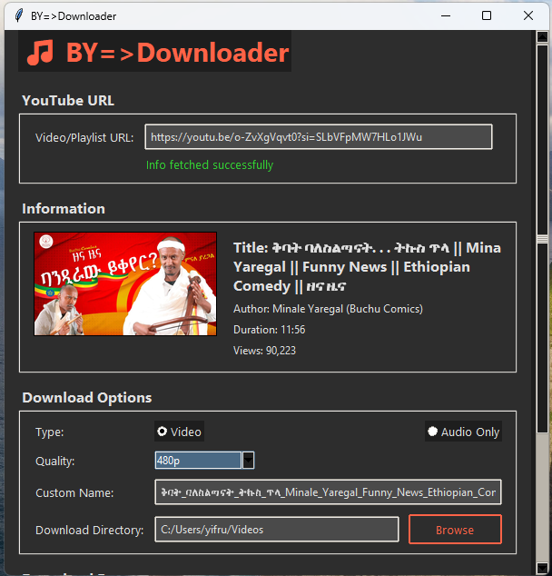

# BY YouTube Downloader

A modern, feature-rich YouTube downloader built with Python and Tkinter. Download single videos or entire playlists with an elegant dark-themed GUI.



## ✨ Features

- **Download Videos & Audio** - Choose between video (MP4) or audio-only (MP3) downloads
- **Playlist Support** - Download entire playlists or select specific ranges
- **Multiple Quality Options** - Select from highest, lowest, or specific resolutions/bitrates
- **Stream Selection** - Browse and choose from all available streams for precise control
- **Auto-Fetch** - Automatically fetches video info as you type/paste a URL
- **Thumbnail Preview** - Displays video thumbnail after fetching
- **Custom Filenames** - Rename downloads before saving
- **Progress Tracking** - Real-time progress bar with download speed and file size
- **Dark Theme** - Easy on the eyes with a professional dark interface
- **Cross-Platform** - Works on Windows, macOS, and Linux

## 🖼️ Screenshots

*[Add screenshots here]*

## 📋 Requirements

- Python 3.7 or higher
- Internet connection for downloading videos

### Python Dependencies

```
pytubefix
Pillow
requests
tkinter (included with Python)
```

## 🚀 Installation

1. **Clone the repository**
   ```bash
   git clone https://github.com/yourusername/by-youtube-downloader.git
   cd by-youtube-downloader
   ```

2. **Install required packages**
   ```bash
   pip install pytubefix pillow requests
   ```

3. **Run the application**
   ```bash
   python "BY youtube video downloder.py"
   ```

## 📖 Usage Guide

### Downloading a Single Video

1. **Paste or type a YouTube URL** in the input field
   - The app will automatically fetch video information
   - Thumbnail and details will appear

2. **Choose download options**
   - Select **Video** or **Audio Only**
   - Choose quality (highest, specific resolution, or browse all streams)
   - Optionally set a custom filename

3. **Click "Start Download"** and watch the progress

### Downloading a Playlist

1. **Enter a playlist URL** (e.g., `https://youtube.com/playlist?list=...`)
2. **Choose download range**
   - All videos in the playlist
   - Custom range (e.g., videos 1-10)
3. **Select quality preferences** (applies to all videos)
4. **Start download** - videos will be saved in a playlist-named folder

### Advanced Features

- **Browse Streams**: Select "list_streams" from quality dropdown to see all available formats
- **Custom Download Directory**: Change where files are saved using the Browse button
- **Open Folder**: Quickly access your downloads folder
- **Clear All**: Reset all fields and start fresh

## 🎨 Interface Overview

- **URL Input**: Paste or type YouTube links with auto-fetch capability
- **Information Panel**: Displays title, author, duration, views, and thumbnail
- **Download Options**: Choose type, quality, and custom filename
- **Stream Selection**: Tree view of all available streams when "list_streams" is selected
- **Progress Section**: Real-time download progress with percentage and file size
- **Control Buttons**: Start, cancel, clear, and open download folder

## ⚙️ Configuration

The download path is saved in `config.ini` for persistence between sessions. Default download location is the `downloads` folder in the application directory.

## 🔧 Troubleshooting

### Common Issues

1. **"Invalid YouTube URL"**
   - Ensure the URL is from youtube.com or youtu.be
   - Check for typos or incomplete URLs

2. **Download fails or hangs**
   - Check your internet connection
   - The video might be age-restricted or unavailable
   - Try a different quality option

3. **No streams found**
   - Some videos may have limited formats available
   - Try using "highest" quality instead of specific resolution

4. **Thumbnail not loading**
   - Check internet connection
   - Some videos might not have thumbnails available

## 🛠️ Technical Details

### Built With

- **pytubefix** - For YouTube video/playlist extraction
- **Tkinter** - GUI framework
- **Pillow** - Image processing for thumbnails
- **Requests** - HTTP requests for thumbnail downloading

### Key Components

- **Auto-fetch mechanism** with debouncing to prevent excessive API calls
- **Threaded downloads** to keep UI responsive
- **Dynamic quality filtering** based on download type
- **Playlist management** with custom range selection
- **Progress callbacks** for real-time updates

## 📝 License

This project is open source and available under the MIT License.

## ⚠️ Disclaimer

This tool is for educational purposes only. Downloading copyrighted material may violate YouTube's Terms of Service. Users are responsible for complying with applicable laws and regulations.

## 🤝 Contributing

Contributions, issues, and feature requests are welcome! Feel free to check the [issues page](link-to-issues).

### Development Setup

1. Fork the repository
2. Create a feature branch
3. Make your changes
4. Submit a pull request

## 📞 Support

For support, please:
- Check the [Issues](link-to-issues) page
- Create a new issue with detailed information about your problem

## 🙏 Acknowledgments

- [pytubefix](https://github.com/JuanBindez/pytubefix) for the YouTube API wrapper
- The Python community for excellent libraries and tools

---

**Made with ❤️ for easy YouTube downloads**
